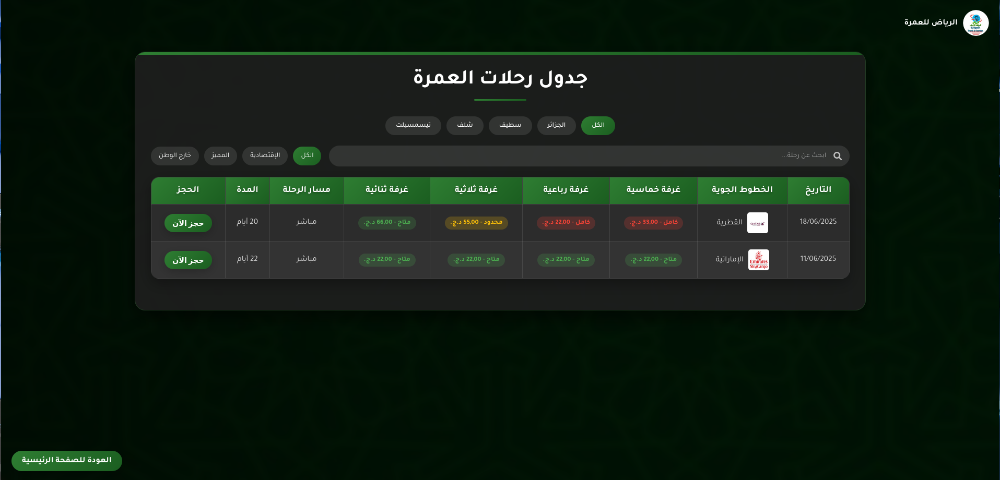
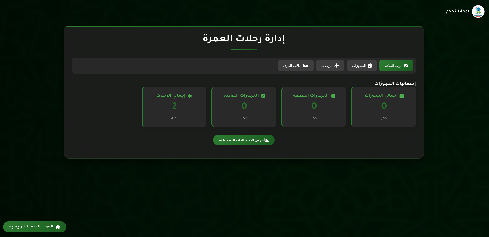
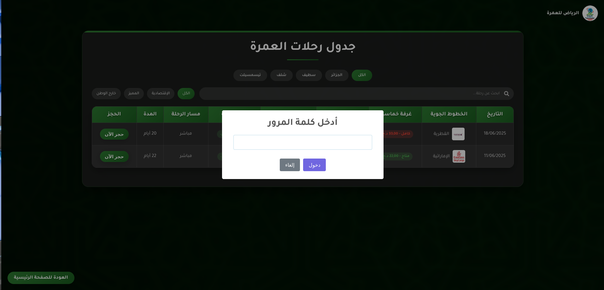
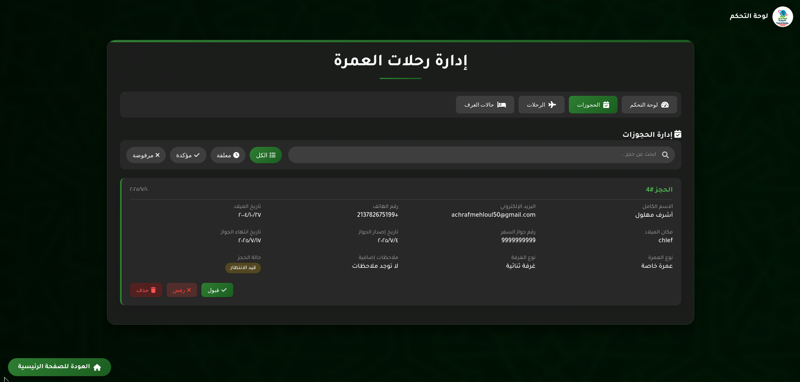
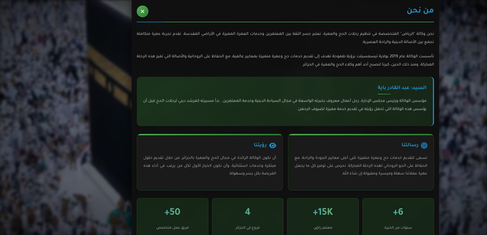
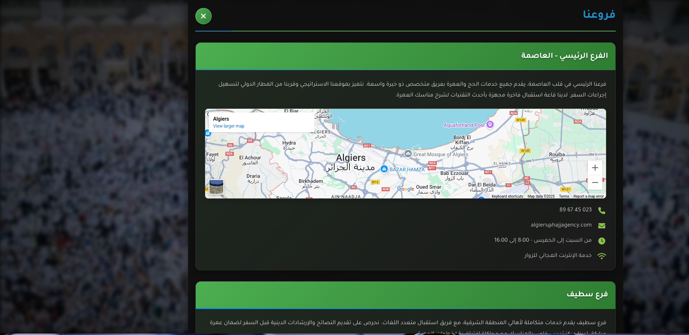
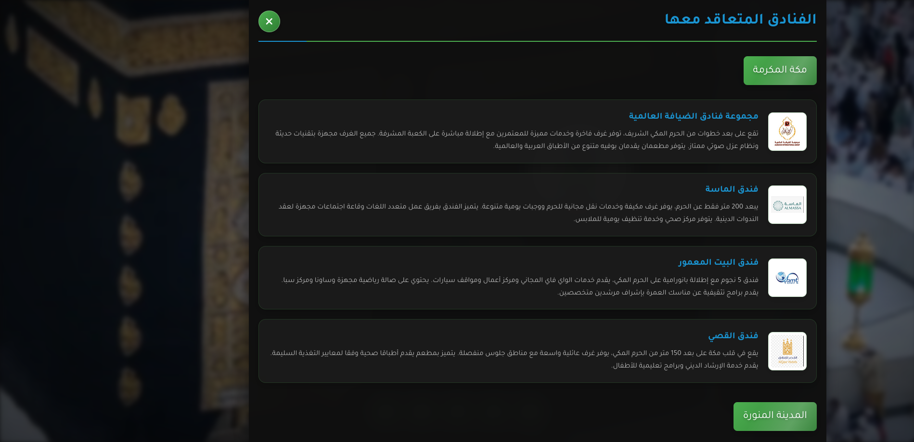

# 🕋 Arriyadha Umrah Agency – Digital Web Platform | وكالة الرياض للعمرة – المنصة الرقمية

Welcome to the official repository of **Arriyadha Umrah Agency**, a professional and dynamic digital platform built to streamline Umrah services for a private travel agency. This web application offers a modern user interface to display Umrah packages, handle reservations, and manage the system via a secure admin dashboard.

مرحبًا بك في المستودع الرسمي لـ **وكالة الرياض للعمرة**، منصة رقمية احترافية وحديثة تم تطويرها لتسهيل خدمات العمرة لوكالة سفر خاصة. توفر هذه المنصة واجهة استخدام عصرية لعرض برامج العمرة، معالجة الحجوزات، وإدارة النظام من خلال لوحة تحكم آمنة.

---

## 🌐 Live Demo | العرض المباشر

🔗 [Click to visit the website | اضغط هنا لزيارة الموقع](https://elriyad-travel-2.onrender.com)

---

## 📸 Screenshots | لقطات الشاشة

| Section | القسم | Preview |
|--------|--------|---------|
| Homepage | الصفحة الرئيسية |  |
| Umrah Programs | برامج العمرة |  |
| Admin Dashboard | لوحة التحكم |  |
| Login Page | صفحة الدخول |  |
| Mobile View | العرض على الهاتف |  |
| Package Details | تفاصيل الباقة |  |
| Team Section | فريق العمل |  |
| Contact Page | صفحة التواصل |  |
| Footer | التذييل |  |
| Gallery | المعرض |  |
| Booking Button | زر الحجز |  |
| Reservation Form | نموذج الاستمارة |  |

---

## 🚀 Features | الخصائص

- 🕌 Elegant homepage with Umrah highlights | صفحة رئيسية أنيقة تسلط الضوء على برامج العمرة  
- 🧾 Reservation form with user input | نموذج حجز تفاعلي وسهل الاستخدام  
- 🧑‍💼 Secure admin dashboard | لوحة تحكم إدارية آمنة  
- 🌐 Fully responsive design | تصميم متجاوب مع جميع الأجهزة  
- 🔐 Basic authentication system | نظام تسجيل دخول أساسي  
- 🗂️ Organized static and media files | تنظيم احترافي للصور والملفات

---

## 🛠️ Technologies Used | التكنولوجيا المستخدمة

| Layer | الطبقة | Technologies |
|-------|--------|--------------|
| Frontend | الواجهة الأمامية | HTML5, CSS3, JavaScript |
| Backend | الخادم | Python (Flask) |
| Templates | القوالب | Jinja2 |
| Database | قاعدة البيانات | SQLite (`umrah.db`) |
| Hosting | الاستضافة | Render.com |

---

## 📁 Project Structure | بنية المشروع

```bash
el-riyad-travel/
├── app.py               # Main Flask app | ملف Flask الرئيسي
├── index.html           # Landing page | الصفحة الرئيسية
├── readme.md            # Project documentation | ملف التوثيق
├── requirements.txt     # Python requirements | المتطلبات
├── umrah.db             # SQLite database | قاعدة البيانات
├── myenv/               # Virtual environment (excluded) | البيئة الافتراضية
│
├── static/              # Static files | الملفات الثابتة
│   ├── index-1.html     # Umrah packages page | صفحة برامج العمرة
│   ├── dashboard.html   # Admin panel | لوحة التحكم
│   ├── style.css        # Stylesheet | التنسيقات
│   └── img1.jpg         # Example image | صورة مثال
│
└── screen-shoot/        # Screenshots | لقطات الشاشة
    ├── 1.png
    ├── 2.png
    └── ... to 12.png
```

---

## ⚙️ How to Run Locally | كيفية التشغيل محليًا

```bash
# Clone the repo | استنساخ المشروع
git clone https://github.com/yourusername/el-riyad-travel.git
cd el-riyad-travel

# Create virtual environment | إنشاء بيئة افتراضية
python -m venv myenv
source myenv/bin/activate  # On Windows: myenv\Scripts\activate

# Install dependencies | تثبيت المتطلبات
pip install -r requirements.txt

# Run the app | تشغيل التطبيق
python app.py
```

---

## 📬 Contact | معلومات التواصل

- 📧 Email | البريد: achrafmehloul50@gmail.com  
- 🇩🇿 Country | البلد: Algeria  
- 👨‍💻 Developer | المطور: Achraf (project developed 100% from scratch as a commercial paid service)  
- 💼 Status | الحالة: Commercial project for a private Umrah agency

> 🎯 *Creativity is intelligence having fun.* — Albert Einstein  
> 🎯 *الإبداع هو الذكاء عندما يستمتع* — ألبرت آينشتاين

---

## 🏷️ License | الترخيص

This is a **commercial project**, developed under contract. Redistribution or reuse without permission is prohibited.

هذا المشروع **تجاري** تم تطويره بمقابل مادي. لا يُسمح بإعادة نشره أو استخدامه دون إذن رسمي.
